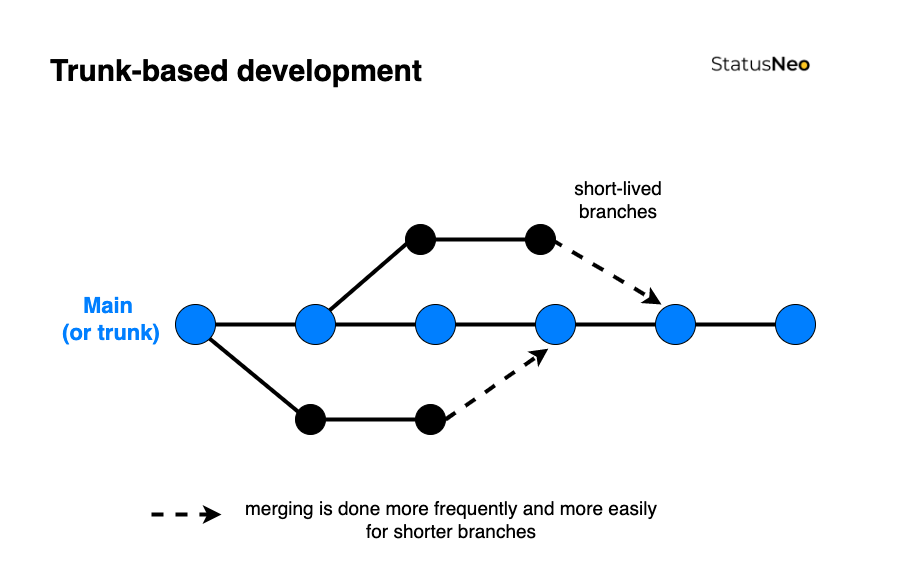

# Developer guidelines

## Table of Contents 📜

<!-- vim-markdown-toc GFM -->

- [Branching model 🌲](#branching-model-)
  - [Key concepts](#key-concepts)
    - [Trunk aka. `main`](#trunk-aka-main)
    - [Committing directly to the `main`](#committing-directly-to-the-main)
    - [Feature branches](#feature-branches)
- [Commits 📌](#commits-)
  - [Message style and convention](#message-style-and-convention)
    - [Structure and rules](#structure-and-rules)
    - [Types](#types)
    - [Scope](#scope)
  - [Commit and message content](#commit-and-message-content)
  - [Example commit messages](#example-commit-messages)
- [Coding standards 📚](#coding-standards-)
  - [C/C++ 🇨](#cc-)
    - [Source code documentation](#source-code-documentation)
    - [Doxygen guidelines](#doxygen-guidelines)
    - [Coding style](#coding-style)
    - [Include statements](#include-statements)
  - [Python 🐍](#python-)
    - [Coding standard](#coding-standard)
    - [Coding style](#coding-style-1)
    - [Docstrings](#docstrings)
  - [Rust 🦀](#rust-)
    - [Coding style](#coding-style-2)
    - [Doc comments](#doc-comments)
  - [JavaScript/TypeScript 🇯🇸 / 🇹🇸](#javascripttypescript---)
    - [General guidelines](#general-guidelines)
    - [Coding standard](#coding-standard-1)
    - [Coding style](#coding-style-3)
    - [Docstrings](#docstrings-1)
  - [Short scripts in various languages 💣](#short-scripts-in-various-languages-)
    - [Documentation](#documentation)
    - [Shebang lines](#shebang-lines)

<!-- vim-markdown-toc -->

## Branching model 🌲

<p align="center">
  <br><br>
    <i>Trunk-based development branching model, source: <a href="https://statusneo.com/trunk-based-development/">StatusNeo</a></i><br>

</p>

The IRNAS's Git branching model is based on the [Trunk-based development] branching model with some
minor differences.

### Key concepts

#### Trunk aka. `main`

Each repository has a single long-lived, default branch named `main`.

Two rules should be followed when adding new code to `main`:

- It should **never break the build** (whatever _build_ means for a specific repository). Bugs
  should be caught by automated tests, static analysis tools or by code reviews.
- `main` should **always be release-ready**, even if there is work in progress.

Functionalities that might need some more development time to become useful should not be included
in the build until they are ready. For example: don't include unfinished source files in
`CMakelists.txt` files, don't merge feature branches until they are ready, etc.

Those two rules can sometimes be hard to follow in practice due to unforeseen circumstances. If a
deviation from those two rules happens effort should be made to bring the `main` branch into the
correct state (**buildable** and **release-ready**).

New code can be added to `main` in two ways:

- either by committing to it directly, or
- in the form of feature branches.

#### Committing directly to the `main`

If you are working alone on the project and your work is trivial, then you can commit directly to
the `main` branch.

As soon you are:

- working in a repository alongside other developers,
- want your work reviewed or
- making critical changes

then you probably want to create a feature branch for your changes and have your work reviewed by
another developer.

#### Feature branches

A few things should be kept in mind when working with the feature branches:

- They should be focused on accomplishing one small thing.
- They should take up to 1 day of work to complete. Once complete, a Pull Request into `main` branch
  should be created for the code review.

The rapid, small commits of trunk-based development make code review a more efficient process. With
small branches, developers can quickly see and review small changes. This is far easier compared to
a long-lived feature branch where a reviewer reads pages of code or manually inspects a large
surface area of code changes.

Use the `feature/<branch name>` format when naming feature branches, for example
`feature/new-cool-subsystem`.

## Commits 📌

This section outlines general guidelines to follow when making commits and writing commit messages.

A lot has been said on this topic, so it is best to refer to external resources and then highlight
important points.

Resources:

- [Source control commit guidelines by Embedded Artistry] - The main resource related to the commit
  content and message content. **Read this first, before reading the rest**.
- [One Idea is One Commit] - Interesting committing strategy, comparable to atomic commits.

### Message style and convention

We follow [Conventional Commits] with a minor deviation:

- since we do not usually create libraries, everything related to the `BREAKING-CHANGE` and `!` rule
  is ignored. Specifically ignore rules 11., 12., 13., 15., and 16. of the Conventional Commits
  [specification].

[Conventional Commits]: https://www.conventionalcommits.org/
[specification]: https://www.conventionalcommits.org/en/v1.0.0/#specification

We use [`committed`] tool (run by the `pre-commit`) to validate commit messages. For relevant
configuration see [`committed.toml`] file in our template repository.

[`committed`]: https://github.com/crate-ci/committed
[`committed.toml`]: https://github.com/IRNAS/irnas-zephyr-template/blob/main/commited.toml

#### Structure and rules

The commit message should be structured as follows:

```code
<type>[optional scope]: <subject>

[optional body]

[optional footer(s)]
```

General rules that must be followed:

- Every commit message must have a type and a subject. Scope, body and footer sections are optional.
- Separate the subject from the body with a blank line. The subject line should be around 50
  characters, the maximum is 72.
- Do not end the subject line with a period.
- Use the imperative mood in the subject line.
- Wrap the body at 72 characters.
- Add a body when the change needs more context.
- Use the footer to provide links to the relevant GitHub issues.

#### Types

The type field tells us what kind of change a particular commit is doing.

Must be one of the following:

- `feat`: A new feature was added.
- `fix`: Bug was fixed.
- `docs`: Only documentation was added, improved or removed (applies also to source code
  documentation).
- `refactor`: A code change that neither fixes a bug nor adds a feature.
- `style`: Change was made that doesn't affect the meaning of the code (white space, formatting,
  missing semi-colons, etc.)
- `test`: Only tests were added, improved or removed.
- `infra`: Anything related to the CI or automation changed. For example: any change to the GitHub
  Action files, `.pre-commit.config.yaml` or any other of the configuration files.
- `misc`: Catch-all type. Use it when none of the other types fit.

#### Scope

The scope field is optional. Use it to provide information on what part of the
codebase/functionality changed. Possible examples are: `driver`, `lwm2m_ctrl`, `ui`, `lora`, etc.

General rules:

- There is no list of valid scope fields. **Use what makes sense.**
- **Use consistent scopes inside the project**. Look through the `git log` when making changes on a
  project that a different developer worked on earlier. Avoid using different words for the same
  scope. For example, don't mix `driver` and `drivers`, pick one and stick to it.

### Commit and message content

The below sections are copied directly from [Source control commit guidelines by Embedded Artistry].

About the content of the commits:

> 1. All changes in a commit should be related.
>    - Don't combine changes that address different problems into a single commit.
> 2. All changes in a commit should address a single aspect of a problem or change.
>    - Don't be afraid to break up a new feature, bug fix, or refactoring effort into multiple
>      distinct changes.
>    - This will help you keep track of what works and what doesn't: if there's a problem, you can
>      always revert to the last known good state. If you wait too long between commits, you may
>      lose a lot of work or spend too long finding the source of the problem.
> 3. Prefer small commits to large commits.
>    - This helps reviewers by allowing them to focus on a small set of related changes.
>    - This helps future debugging efforts by increasing the probability that a git bisect operation
>      will quickly identify the source of the problem.

About the content of the commits messages:

> Most importantly, the commit message body should be used to explain what you are doing and why you
> did it that way, rather than how you did it. The code itself serves to explain the how. Focus on
> side effects, compatibility changes, or other consequences that are not immediately obvious from
> reviewing the code. Also, include any important factors that helped you arrive at your particular
> approach.
>
> Not all commit messages require both a subject and a body. You can include only a subject if it is
> sufficient for a given commit.

### Example commit messages

1. New feature.

   ```code
   feat(battery): add support for battery SOC received from nrf52

   display_comm_ctrl now supports battery SOC received from nrf52.
   The SOC is emitted as an event and handled in lwm2m_status_ctrl.

   Related: #24
   ```

2. Spelling change.

   ```code
   docs: correct spelling in CHANGELOG.md
   ```

3. Trivial stylistic change.

   ```code
   style: format user_guide.md
   ```

4. Bug fix with body and footer.

   ```code
   fix(drivers): add a mutex to the uart_mux module

   Without this fix firmware just asserts, if someone wants to access the uart_mux
   module, while it is already taken by someone else.

   This was a "day-0" issue, although it never happened in practice due to how
   uart_mux was used.

   Correct approach is to use the k_mutex to protect the resource. Now the second
   user that tries to lock uart_mux will simply wait, which is fine.

   Closes: #99
   ```

## Coding standards 📚

### C/C++ 🇨

#### Source code documentation

The following section has been adapted from the [Patterns in the Machine] book and the [Google's
Python Style Guide], section _3.8 Comments and Docstrings_.

Considers header files to be “data sheets”. In the header files, you want to summarize:

- what the function does,
- what are its inputs and outputs,
- what are the required preconditions and
- what are the possible side effects.

The goal is that comments provide enough information to the programmer so that he can use the module
without reading its implementation. Do not document implementation details in the header files,
unless those details are relevant to how the function should be used (try to avoid this if you can).
Do not duplicate information in multiple places in the code.

Concretely this means:

- Describe the module at the top of the header file. Optionally, add a brief description of
  functions and/or usage examples. If documenting a driver-level module, include a link to the
  datasheet and mention relevant sections. See [template files] in this repository for examples.
- Document all externally visible constructs in the header files. Always comment functions,
  function-like macros, structs and enums. You can omit comments of macro defines and constants if
  their use and meaning are obvious.
- Don't document internally visible static functions, or function-like macros if they are very short
  and obvious. The same goes for the structs, enum, and macro definitions.
- Add single or multi-line comments before tricky or non-obvious parts in code. Describe what and
  why the code is trying to do, not how is doing it.

See the below snippet for an example of good documentation from the Zephyr codebase:

```c
/**
 * @brief Lock a mutex.
 *
 * This routine locks @a mutex. If the mutex is locked by another thread,
 * the calling thread waits until the mutex becomes available or until
 * a timeout occurs.
 *
 * A thread is permitted to lock a mutex it has already locked. The operation
 * completes immediately and the lock count is increased by 1.
 *
 * Mutexes may not be locked in ISRs.
 *
 * @param mutex Address of the mutex.
 * @param timeout Waiting period to lock the mutex,
 *                or one of the special values K_NO_WAIT and
 *                K_FOREVER.
 *
 * @retval 0 Mutex locked.
 * @retval -EBUSY Returned without waiting.
 * @retval -EAGAIN Waiting period timed out.
 */
__syscall int k_mutex_lock(struct k_mutex *mutex, k_timeout_t timeout);
```

#### Doxygen guidelines

For documenting the code constructs use [Doxygen] style comments. The structure of these is defined
by [nRF Connect SDK's Doxygen guidelines]. Follow these guidelines completely, except for the _File
headers and groups_ section, for an example of a file header refer to the `c_cpp_template.h` file.

#### Coding style

Follow [Zephyr's Coding Style]. Zephyr's Coding Style generally follows a [Linux kernel coding
style] with few exceptions.

Almost all sections in the Linux kernel coding style are relevant to firmware programming, some
might need minor changes to become relevant:

- [Printing kernel messages] - Replace kernel messages with log messages.
- [Allocating memory] - Contains mentions of kernel-specific memory allocators, but, the advice
  still applies.
- [The inline disease] - Again, somewhat kernel specific, we rarely use `inline` keyword in our
  code, but, the advice still applies.

#### Include statements

Include statements should be placed at the top of the file, after the license header and before any
other code. In header files, they should be placed after header guards and `extern C` guards.

Include only what is necessary to compile the source code. Adding unnecessary includes means a
longer compilation time, especially in large projects. Each header and corresponding source file
should compile cleanly on its own. That means, if you have a source file that includes only the
corresponding header, it should compile without errors. The header file should include not more than
what is necessary for that.

Include statements belonging to the same include group should be written together with no space in
between, ordered alphabetically(`clang-format` does this for you). Different include groups should
be separated by a single empty line.

Include groups should be ordered from top to bottom following the below list:

1. Corresponding header file
2. Header files from the project's codebase
3. Header files from Zephyr
4. Header files from NRF
5. Other 3rd party headers
6. System header files such as `stdio.h`, `stddef.h`, `string.h` and other stdlib files
7. C/C++ implementation files (rarely needed, but it can happen)

Of course, header files do not include themselves.

Below is an example for `ui.c` file:

```c
/* Corresponding header file */
#include "ble_ctrl.h"

/* From this codebase */
#include <ble_adv.h>
#include <ble_conn.h>
#include <ble_helpers.h>
#include <ble_status.h>

/* From Zephyr */
#include <zephyr/bluetooth/addr.h>
#include <zephyr/bluetooth/bluetooth.h>
#include <zephyr/logging/log.h>

/* From NRF */
#include <app_event_manager.h>

/* From STDLIB */
#include <string.h>

```

With proposed ordering where includes are grouped from local to global is easy to detect hidden
dependencies. That way you can avoid introducing hidden dependencies.

If you reverse the order and i.e. `ui.c` includes `<string.h>` and then `"ui.h"`, there is no way to
catch at build time that `ui.h` may itself depend on `<string.h>`. So if later someone includes
`ui.h` but does not need `<string.h>`, he'll get an error that needs to be fixed either in the
source or header file.

### Python 🐍

#### Coding standard

Follow [Google's Python Style Guide]. We do **not enforce** conformity to this guide. Read it and
learn from it.

#### Coding style

Follow the [Black code style] that is enforced by the formatting tool [Black]. Black is a
PEP8-compliant opinionated formatter with a limited set of configurable options.

We slightly deviate from Black's default code style:

- We use an improved string processing feature, which splits the long string literals and merges
  short ones, more about this
  [here](https://black.readthedocs.io/en/stable/the_black_code_style/future_style.html).

This means that you need to add a few extra arguments when using Black from the command-line or from
your favourite editor:

```bash
black {some file or directory that you want to format} --preview
```

#### Docstrings

Follow [Google's Python Style Guide], section _3.8 Comments and Docstrings_.

Use the `python_template.py` file as a starting point.

See the below snippet for an example of good documentation from the TensorFlow codebase:

```python
@keras_export(v1=['keras.__internal__.legacy.layers.average_pooling2d'])
@tf_export(v1=['layers.average_pooling2d'])
def average_pooling2d(inputs,
                      pool_size, strides,
                      padding='valid', data_format='channels_last',
                      name=None):
  """Average pooling layer for 2D inputs (e.g. images).
  Args:
    inputs: The tensor over which to pool. Must have rank 4.
    pool_size: An integer or tuple/list of 2 integers: (pool_height, pool_width)
      specifying the size of the pooling window.
      Can be a single integer to specify the same value for
      all spatial dimensions.
    strides: An integer or tuple/list of 2 integers,
      specifying the strides of the pooling operation.
      Can be a single integer to specify the same value for
      all spatial dimensions.
    padding: A string. The padding method is either 'valid' or 'same'.
      Case-insensitive.
    data_format: A string. The ordering of the dimensions in the inputs.
      `channels_last` (default) and `channels_first` are supported.
      `channels_last` corresponds to inputs with shape
      `(batch, height, width, channels)` while `channels_first` corresponds to
      inputs with shape `(batch, channels, height, width)`.
    name: A string, the name of the layer.
  Returns:
    Output tensor.
  Raises:
    ValueError: if eager execution is enabled.
  """
```

### Rust 🦀

#### Coding style

Follow [Rust Style Guide]. Use the [rustfmt] tool for formatting Rust code according to the style
guide.

#### Doc comments

Follow to [Rust Style Guide], section _Comments_. Use doc comments to document interfaces, the
standard Rust distribution ships with a tool called `rustdoc` which generates documentation from
Rust projects.

For a simple example refer to the [Rust By Example] page. For a more comprehensive document refer to
the [rustdoc book].

### JavaScript/TypeScript 🇯🇸 / 🇹🇸

#### General guidelines

- Using `yarn` instead of `npm` package manager is preferred:
  - `yarn add <package_name>` instead of `npm install <package_name>`,
  - `yarn add --dev <package_name>` instead of `npm install --save-dev <package_name>`,
  - `yarn create` instead of `npx`.
- It is suggested to start a new project by using templates for React or RN (React Native).
- Typescript usage is recommended.

#### Coding standard

Follow guidelines from [Jared Palmer](https://github.com/jaredpalmer/typescript). They were written
for TS but most of the sections apply also to JS.

For more information about the languages and coding styles refer to:

- [JavaScript.info](https://javascript.info/) for JS
- [TypeScript lang](https://www.typescriptlang.org/docs/) for TS

#### Coding style

Style should be automatically enforced by the linter and formatter. In VS Code this is done by the
following two plugins: ESLint (for linting) and Prettier (for code formatting). Install them from
**extensions** menu.

One should use configuration files, which are available in this repo [here](/tools/js_ts-config).
Files are organized in folders, depending of the project type (React, React Native or Node). All
these files need to be located in the root directory of the target project.

List of files:

1. TS compiler config
2. Linter config
3. Code formatter config
4. Linter ignore file
5. Code formatter ignore file

Note that you also need to install packages for `eslint` and `prettier` in the project:

```bash
yarn add --dev eslint @typescript-eslint/parser @typescript-eslint/eslint-plugin
yarn add --dev prettier eslint-config-prettier
```

And add these to scripts inside `package.json`:

```js
  "lint": "eslint --ext .js,.ts .",
  "format": "prettier --ignore-path .eslintignore --write \"**/*.+(js|ts|json)\"",
  }
```

To automatically format your code when saving, open VS Code `settings.json` file and add these two
lines:

```js
"editor.defaultFormatter": "esbenp.prettier-vscode",
"editor.formatOnSave": true,
```

#### Docstrings

Use style comments from **JSDoc** for functions, interfaces, enums, and classes. Documentation is
available [here](https://jsdoc.app/index.html).

See the example below:

```ts
/**
 * Compares two software version numbers (e.g. "1.7.1" or "1.2b").
 *
 * This function was born in http://stackoverflow.com/a/6832721.
 *
 * @param {string} v1 The first version to be compared.
 * @param {string} v2 The second version to be compared.
 * @param {object} [options] Optional flags that affect comparison behaviour:
 *         - lexicographical: true</tt> compares each part of the version strings lexicographically instead of
 *         naturally; this allows suffixes such as "b" or "dev" but will cause "1.10" to be considered smaller than
 *         "1.2".
 *         - zeroExtend: true</tt> changes the result if one version string has fewer parts than the other. In
 *         this case the shorter string will be padded with "zero" parts instead of being considered smaller.
 *
 * @returns {number|NaN}
 *    - 0 if the versions are equal
 *    - a negative integer iff v1 < v2
 *    - a positive integer iff v1 > v2
 *    - NaN if either version string is in the wrong format
 *
 * @copyright by Jon Papaioannou (["john", "papaioannou"].join(".") + "@gmail.com")
 * This is an updated version from https://github.com/Rombecchi/version-compare
 * @license This function is in the public domain. Do what you want with it, no strings attached.
 */
export function VersionCompare(v1: string, v2: string, options?: { lexicographical: boolean; zeroExtend: boolean }): number {
  ...
}
```

### Short scripts in various languages 💣

#### Documentation

Short scripts in written Python or Bash are often used to automate a simple task or process some
data. Those types of programs are not required to comment on every internal function or class, as
Google's Python Style Guide suggests for example.

The most important documentation that these scripts need to have is **what they do** and **how to
use them**.

These instructions have to be provided to the user when he calls the program with the `--help` flag
or after incorrect use. If the program is simple enough and `argparse` or similar command-line
parsing modules are not used then instructions need to be written at the top of the file in the
comments.

There is a way to generate help strings in Bash scripts from the comments at the top of the file. In
the below example the script will return text from the second line to the end of the comment section
if the user gives a `--help` flag or an insufficient number of arguments.

```bash
#!/usr/bin/env bash
# Usage: get_nrfsdk SDK_LOCATION TOOLCHAIN_LOCATION
#
# Description:
#   Following program will download nRF5 SDK, place it in SDK_LOCATION,
#   prepare Makefile.posix file and compile micro-ecc libraries that
#   are needed for creating a secure bootloader.
#
# Arguments:
#
#   SDK_LOCATION            Folder location where sdk will be installed into.
#                           If it does not exist yet it will be created.
#
#   TOOLCHAIN_LOCATION      Location of arm-none-eabi-gcc binaries on your
#                           system.

NUM_ARGS=2
# Print help text and exit if -h, or --help or insufficient number of arguments
# was given.
if [ "$1" = "-h" ] || [ "$1" = "--help" ] || [ $# -lt ${NUM_ARGS} ]; then
 sed -ne '/^#/!q;s/.\{1,2\}//;1d;p' <"$0"
 exit 1
fi
```

#### Shebang lines

For Python or Bash scripts that you will execute directly specify the shebang line in the first line
of the file.

For Python2:

```python
#!/usr/bin/env python2.7
```

For Python3:

```python
#!/usr/bin/env python3
```

For Bash:

```bash
#! /usr/bin/env bash
```

In that way, you can call the script directly, without specifying an interpreter first. The script
needs to have to execute permissions for this to work, you can do that with:

```bash
sudo chmod +x <script>
```

[source control commit guidelines by embedded artistry]:
  https://embeddedartistry.com/fieldatlas/source-control-commit-guidelines/
[one idea is one commit]:
  https://secure.phabricator.com/book/phabflavor/article/recommendations_on_revision_control/
[rust style guide]: https://github.com/rust-dev-tools/fmt-rfcs/blob/master/guide/guide.md
[rustfmt]: https://github.com/rust-lang/rustfmt
[black code style]: https://black.readthedocs.io/en/stable/the_black_code_style/current_style.html
[black]: https://github.com/psf/black
[zephyr's coding style]:
  https://docs.zephyrproject.org/latest/contribute/guidelines.html#coding-style
[linux kernel coding style]: https://kernel.org/doc/html/latest/process/coding-style.html
[printing kernel messages]:
  https://kernel.org/doc/html/latest/process/coding-style.html#printing-kernel-messages
[allocating memory]: https://kernel.org/doc/html/latest/process/coding-style.html#allocating-memory
[the inline disease]:
  https://kernel.org/doc/html/latest/process/coding-style.html#the-inline-disease
[rust by example]: https://doc.rust-lang.org/rust-by-example/meta/doc.html
[rustdoc book]: https://doc.rust-lang.org/stable/rustdoc/
[patterns in the machine]:
  https://www.amazon.com/Patterns-Machine-Software-Engineering-Development/dp/1484264398
[google's python style guide]:
  https://google.github.io/styleguide/pyguide.html#38-comments-and-docstrings
[doxygen]: https://www.doxygen.nl/
[nrf connect sdk's doxygen guidelines]:
  https://docs.nordicsemi.com/bundle/ncs-latest/page/nrf/dev_model_and_contributions/documentation/styleguide.html
[template files]: source_code_templates
[trunk-based development]:
  https://www.atlassian.com/continuous-delivery/continuous-integration/trunk-based-development
